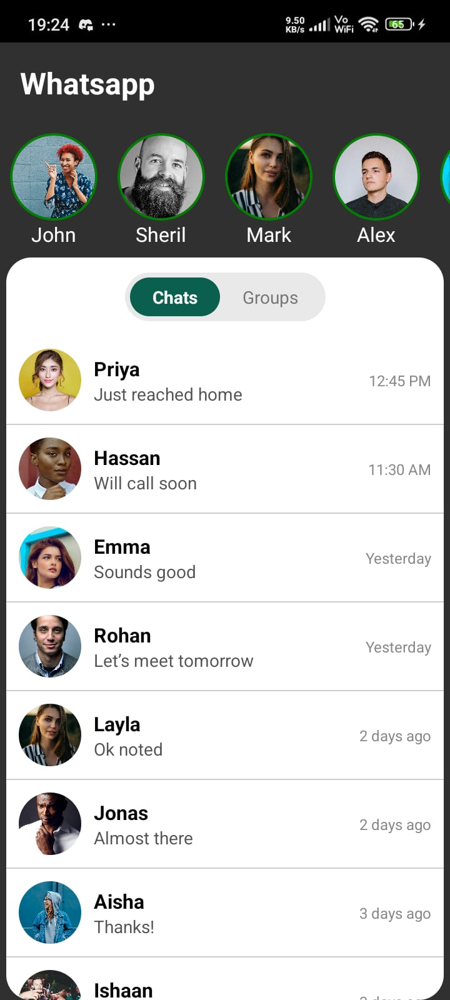
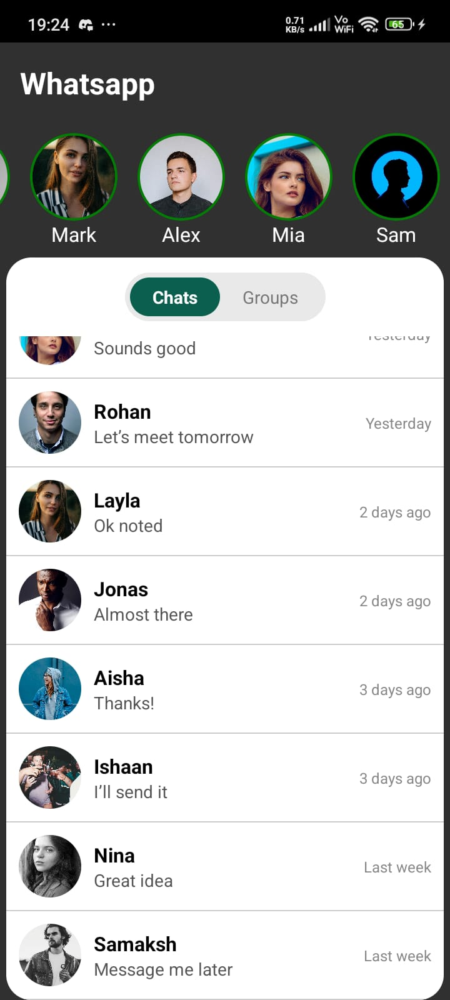

# Modern WhatsApp Redesign – React Native CLI

A minimal WhatsApp redesign built using React Native CLI. The reference was taken from "Modern WhatsApp Redesign - Minimal and Clean design" by "Dinidu Kasun" on "dribbble.com".

## Features
- Modern WhatsApp-style UI
- Horizontal stories section
- Curved header container
- Chats / Groups segmented tabs
- Clean colors and rounded design

## Screenshots

  
  

## Tech
- React Native CLI
- TypeScript
- Android Studio

